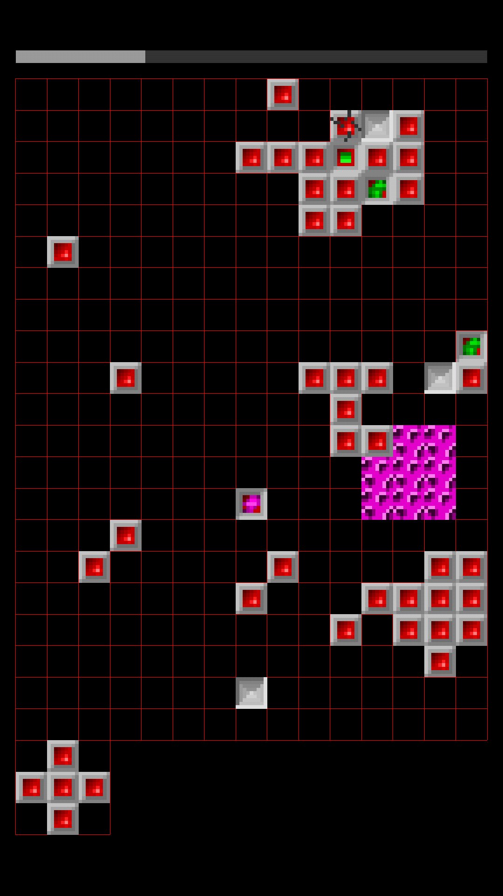

# Squarez game
Simple yet addictive game from the ages of MS-DOS ported to Android.

The game is written using LibGDX engine and part of gameplay mechanics has been ported (see todo.txt).

# Some screenshots

