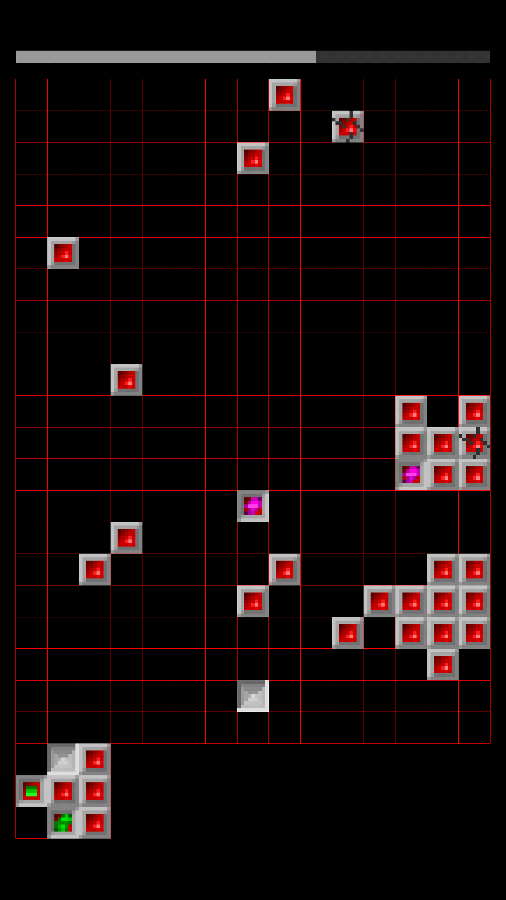
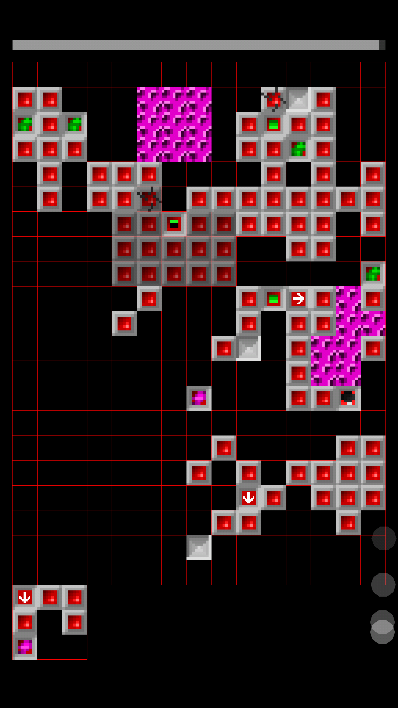
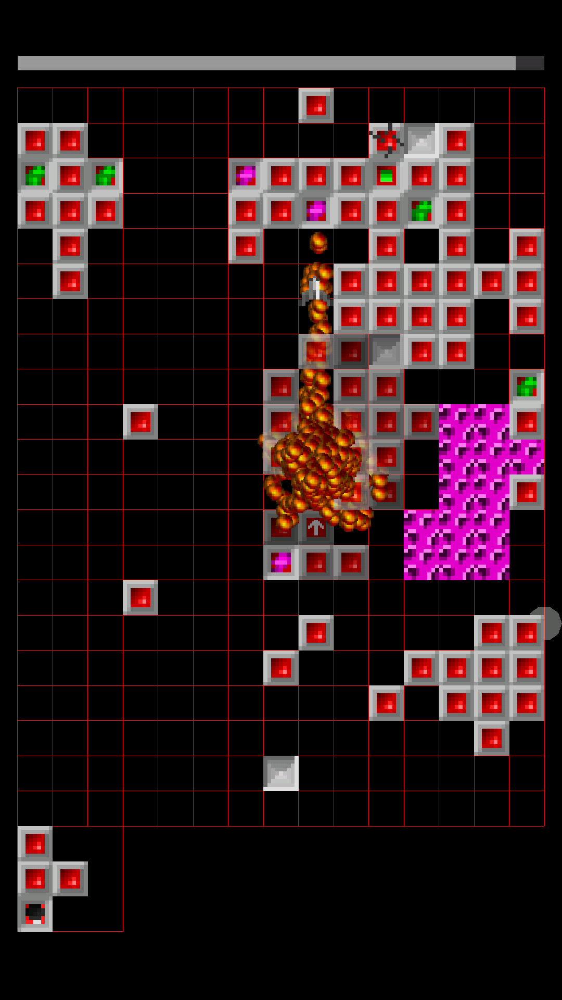
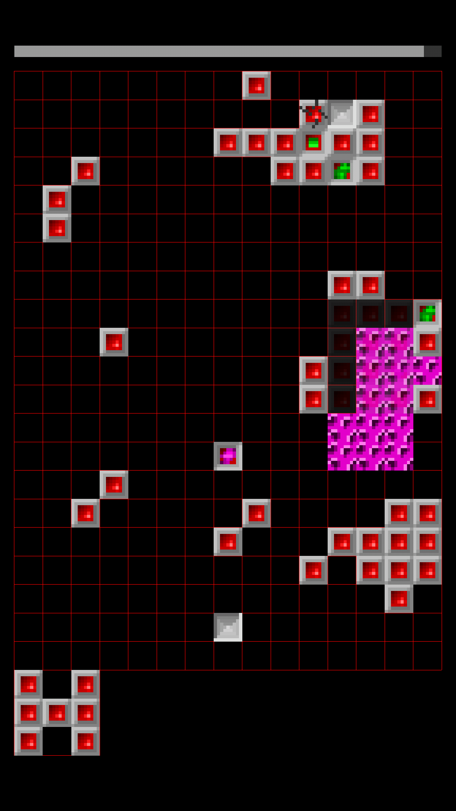
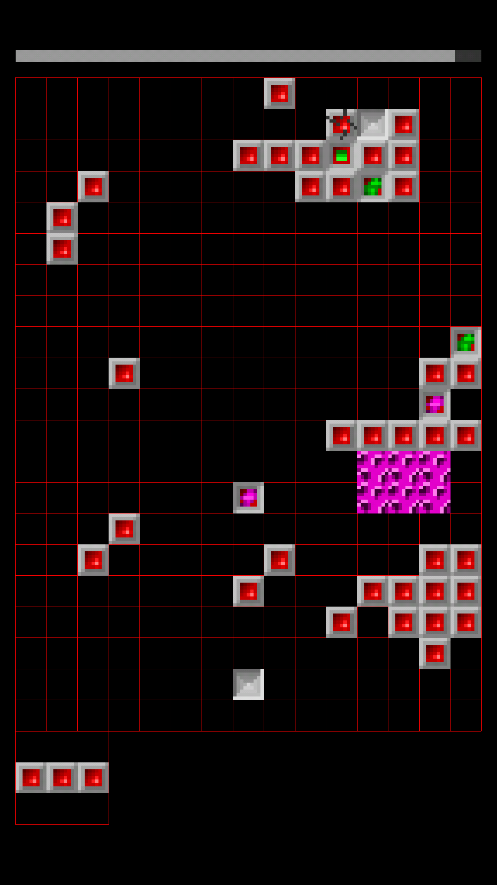
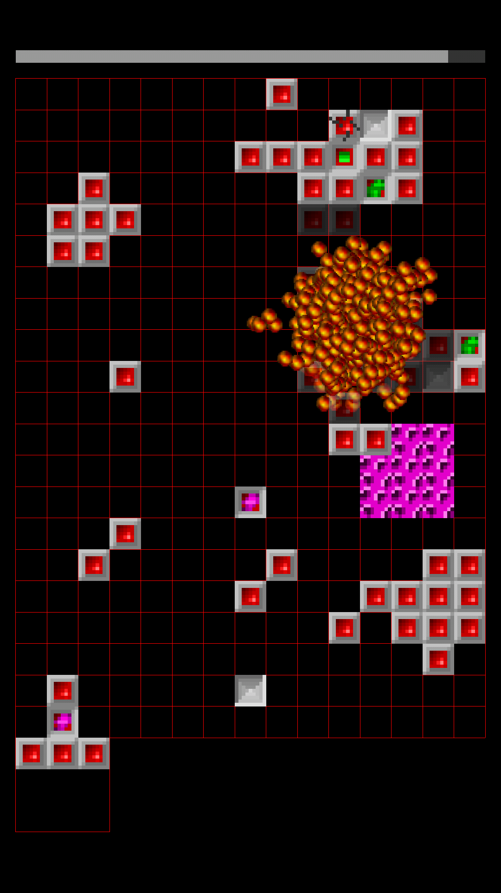

# Squarez game
Simple yet addictive game from the ages of MS-DOS ported to Android.

The game is written using LibGDX engine and part of gameplay mechanics has been ported (see todo.txt).

# Some screenshots

# To-Do

Block types
-----------
- [x] Missile
- [x] Bomb
- [x] Shield
- [x] Steel Pyramid
- [x] Cracked
- [x] Empty cell
- [ ] Arrows
- [x] Splooge
- [x] Splooge container
- [x] Acid
- [x] Acid container
- [ ] Unknown
- [ ] Spikes
- [ ] Activator
- [ ] Releaser
- [ ] Punishment box
- [ ] Touch activated
- [ ] No squarez
- [ ] Ring of shields
- [ ] Plus (double score)
- [ ] Bonus time (time for figure arrangement increased for a given period or until penalty activated)
- [ ] Penalty time (time for figure arrangement decreased for a given period or until bonus activated)
- [ ] Penalty: no rotation allowed

Game
----

- [ ] Figure move trail
- [ ] Bonus for the completely clean board
- [ ] A game mode that starts with randomly filled board
- [ ] Game bonus: no borders - when moving near the certain edge, moving continues from the opposite edge

Render
------

- [ ] Missile sprite must have correct orientation

Bugs
----

- [ ] Clicking figure in pocket resets timer
- [ ] Resolve scissors issue
- [ ] Shield sometimes disappears at the second pass
- [ ] Acid & Splooge containers should release contents on explode/missile hit
- [ ] After figure burning by acid/splooge rotation of small parts (1x2,2x2) is not correct sometimes (?)
